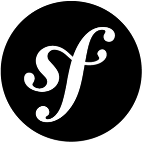

### Hi there, I'm Dylan - [dcorroyer.fr][website] 👋 

<!--  -->

## I'm a Developer and a Learning lover

- 🌱 I’m currently learning Symfony5 (& API-Platform) and VueJS3
- 🥅 2022 Goals: Making a complete Symfony/Nuxt.js app
- ⚡ I love to ride motorcycles and play warzone

### Connect with me:

[][website]
[][linkedin]

 

### Languages and Tools:

#### Tools:

 

#### Front end languages:

 

#### Back end languages:

 

#### Databases:

 
 

---

[website]: https://dcorroyer.fr
[linkedin]: https://www.linkedin.com/in/dcorroyer/
