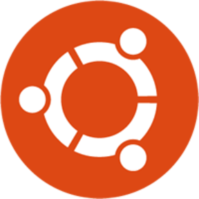
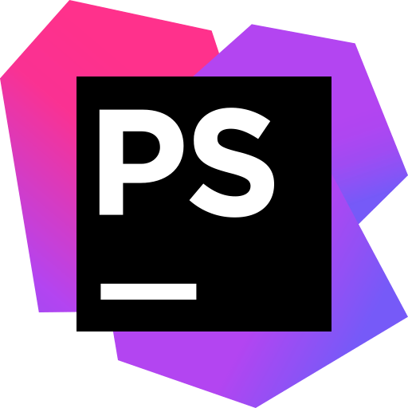
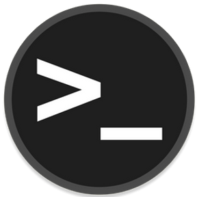
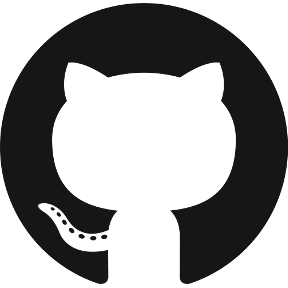
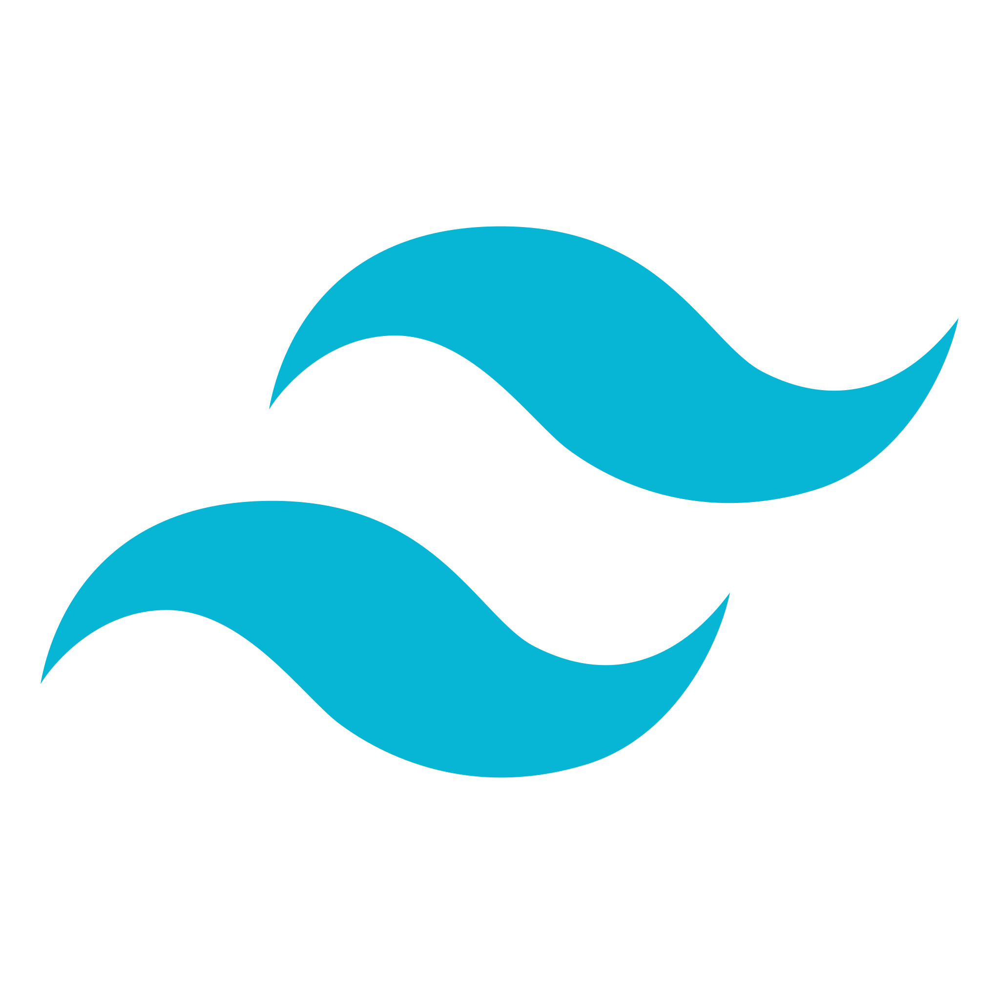

### Hi there, I'm Dylan - [www.dcorroyer.fr][website] 👋

## I'm a Developer and a Learning lover

- ⚡ I am a web developer specialized in Symfony & Laravel
- 🌱 I am currently learning React.JS
- 🥅 2023 Goals: Making a complete PHP8 & React.JS app

### Connect with me:

[][website]
[][linkedin]
[][discord]

 

### Languages and Tools:

#### Tools:

 

#### Front end languages:

 

#### Back end languages:

 

#### Databases:

 
 

---

[website]: https://dcorroyer.fr
[linkedin]: https://www.linkedin.com/in/dcorroyer/
[discord]: https://discord.gg/V5HjYg2dT4
